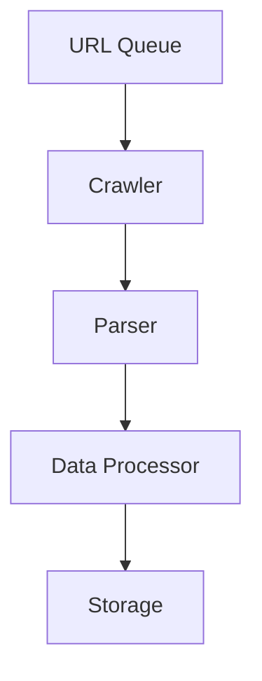

# System Patterns: Web Crawler

## Kiến trúc tổng thể

## Thành phần chính
1. URL Manager:
   - Quản lý hàng đợi URL cần crawl
   - Xử lý ưu tiên và lịch trình
   - Kiểm tra robots.txt

2. Crawler Engine:
   - Gửi HTTP requests bất đồng bộ
   - Xử lý rate limiting
   - Quản lý session/cookies

3. Content Parser:
   - Trích xuất dữ liệu từ HTML/XML
   - Xử lý selector (CSS/XPath)
   - Chuẩn hóa dữ liệu

4. Data Pipeline:
   - Lọc và chuyển đổi dữ liệu
   - Phát hiện trùng lặp
   - Xuất dữ liệu đa định dạng

## Design Patterns sử dụng
- Producer-Consumer cho URL queue
- Strategy Pattern cho các loại parser khác nhau
- Observer Pattern cho logging/monitoring
